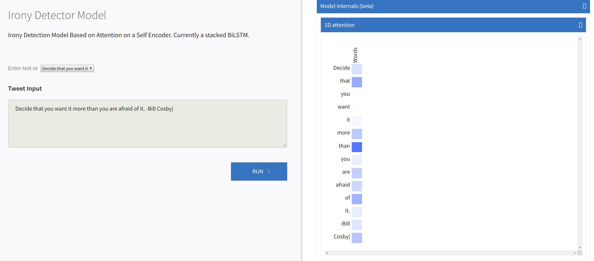
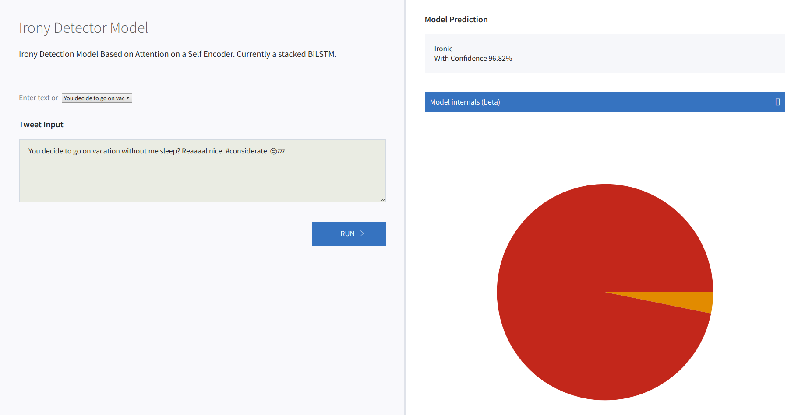

# Irony Detection Research Project

This is a attention  model for Irony Detection Subtask Task 3 held at SemEval 2018. The model is based on the allennlp library.

## Model Description
The code implements two different attention mechanisms for encoding the sentence representations. 

1) Basic attention layer [Paper](https://arxiv.org/abs/1804.06659). Best Performance of model 69.19% F1 score.

2) A Structured Self-attentive Sentence Embedding by Lin et.al. [Paper](https://arxiv.org/abs/1703.03130).Best Performance of model 69.30% F1 score.

The model is composed of three basic components :-
* **Reader** - Responsible for reading the dataset in .txt files in the dataset folder.
* **Model** - The model module defines the neural net we want to use for the model. It is currently a sequence to sequence encoder whoose output is fed to a feed forward network for classification.
* **Predictor** - This part is required for running the demo and evaluate procedure.

The **experiments** directory contains the config files which contains the hyperparameters and the model configuration.

To train the model run:

``` allennlp train  experiments/alternatinglstmmultitask.json  -s directory_path_to_save_model --include-package irony_model```


## What's new in this Implementation
1) Introduces masking in the Structured Self-attentive Sentence Embedding which is present in ```irony_model/modules/module.py```. The sentence encoder can be used with any allennlp model.

2) Example of how to implement multitask learning. Loss function is taken as sum of losses of both the tasks.

3) Implements the macro f1 loss i.e. average of f1 of all the classes. 

4) A seq2seq encoder module with forbenius norm based penalization. 


## Visualizations
For running the react based avisulizations of the attention. There are essentially two things that are needed for the setup

1) The Flask server running (Run the following command)

``` python -m allennlp.service.server_simple     --archive-path /tmp/irony_alternate1/model.tar.gz     --predictor ironic-predictor     --include-package irony_model ```

2) Setting up the React Server for nodejs visualization(Ensure that node js and npm are installed on the system)
* ```npm install``` (Only once)
* ```npm start```

### Examples

### Attention



## Requirements:
* Allennlp==0.7.0
* React js
* Node-js
* npm

## TODO
* Add New Models
* Update Documentation and Readme
* Code Cleanup


